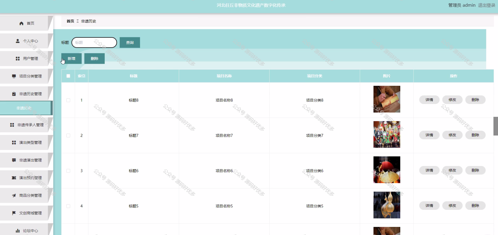

 
## 查看主页获取源码

### 一、作品包含

源码+数据库+设计文档万字+PPT+全套环境和工具资源+部署教程

### 二、项目技术

前端技术：Html、Css、Js、Vue、Element-ui

数据库：MySQL

后端技术：Java、Spring Boot、MyBatis

  

### 三、运行环境

开发工具：IDEA/eclipse

数据库：MySQL5.7

数据库管理工具：Navicat10以上版本

环境配置软件： JDK1.8+Maven3.6.3

前端Nodejs：14

### 四、项目介绍
项目编号：springbootA191

在当今时代背景下，河北任丘的非遗传承面临着新的机遇与挑战。随着科技的飞速发展和人们生活方式的转变，许多非遗项目逐渐被边缘化，传承之路举步维艰。然而，任丘丰富的非遗资源，如工艺精湛的古建青砖制作技艺、气势磅礴的任丘大鼓、曲调悠扬的辛安庄民间音乐会等，都是地域文化的瑰宝，承载着历史的记忆和人们的情感。为了让这些珍贵的非遗项目在新时代焕发出新的活力与光彩，我们急需打造一个多元化、全方位的非遗传承宣传平台。这个平台不仅要成为展示任丘非遗魅力的窗口，更要成为连接非遗与现代社会的桥梁，通过创新的宣传手段和丰富的传播渠道，让更多的人了解、关注并热爱任丘非遗，从而推动其可持续传承与发展，使其在历史的长河中不断绽放独特的光芒。

系统分为管理员和用户
管理员的功能：系统首页、个人中心、用户管理、项目分类管理、非遗历史管理、非遗传承人管理、演出类型管理、非遗演出管理、演出预约管理、商品分类管理、文创商城管理、论坛中心、系统管理、订单管理。
用户的功能：注册、登录、个人中心、非遗历史、非遗传承人、非遗演出、文创商城、论坛中心、非遗资讯、购物车。

### 五、运行截图

  
